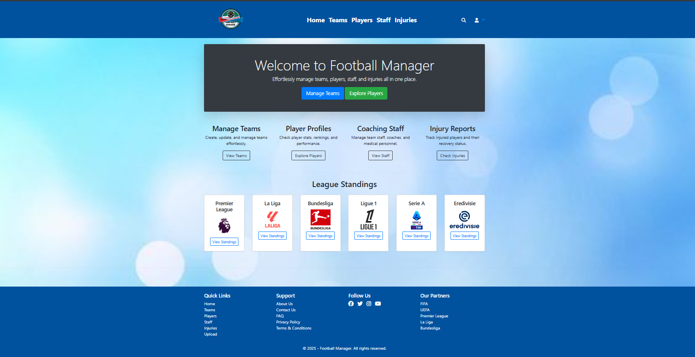
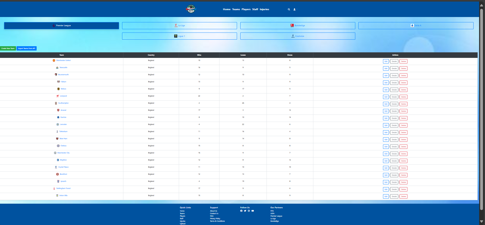
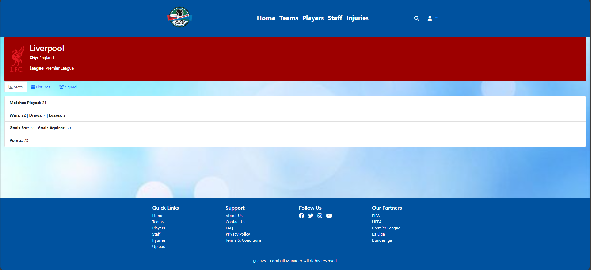
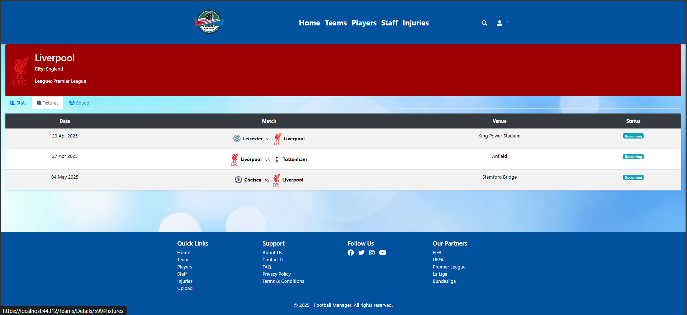
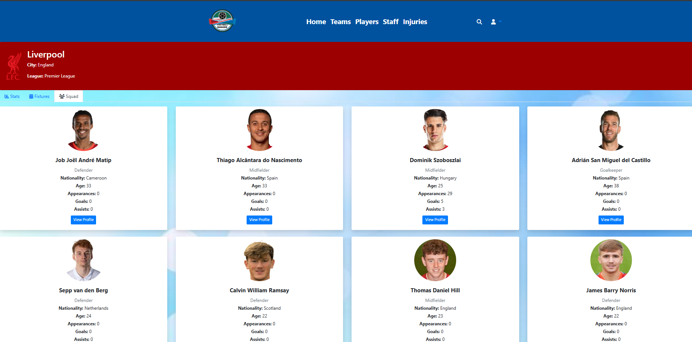
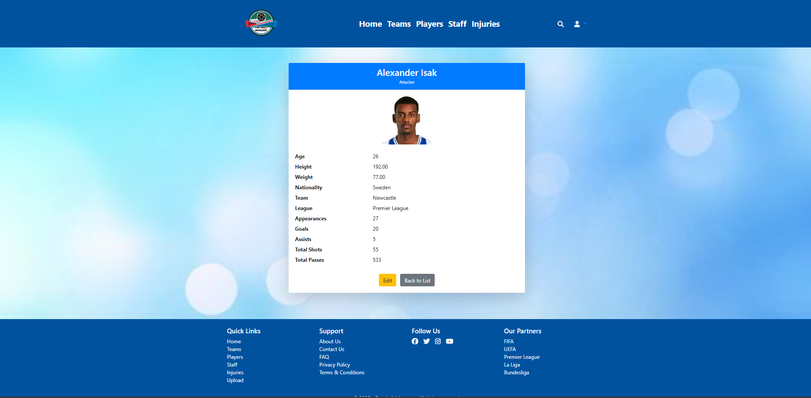
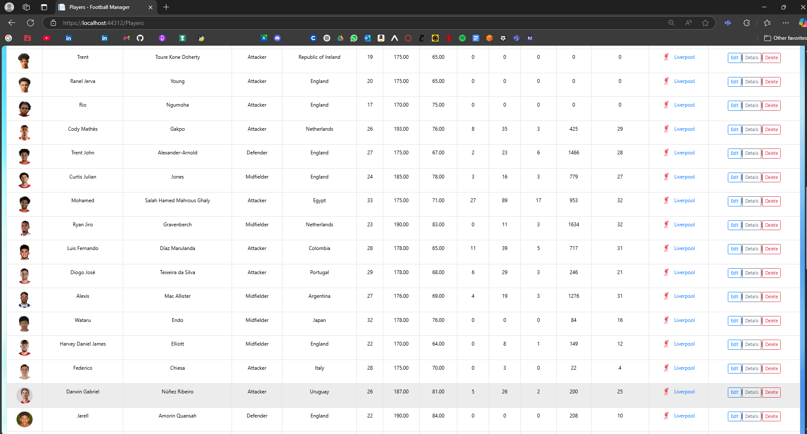

# ⚽ Football Manager

This is a full-featured **Football Manager Web Project** built using **ASP.NET MVC**, developed as a final project for CPAN 369: Web Programming at Humber College. This app simulates the management of football teams, leagues, fixtures players stats, injuries, and more.

# 📁 Project Overview
- View team and player stats
- Access real-time league standings and fixtures
- Authentication using custom login system

## 📚 Topics Covered Along with the Project
This project incorporates concepts and practical skills learned throughout the **CPAN 369: Web Programming with ASP.NET MVC** course, including

### ✔️ Week 1-2
- Introduction to ASP.NET MVC architecture
- Creating simple ASP.NET MVC applications
- Entity Framework (EF) for data access
- LINQ queries and data filtering

### ✔️ Week 3 & 4: HTML Helpers and CRUD
- ActionLinks and strongly-typed HTML Helpers
- Implementing CRUD operations with EF
- Using multiple tables and relationships in MVC

### ✔️ Week 5 & 6: Validation and Form Handling
- Form input validation (client-side and server-side)
- Data annotation attributes
- Custom validation messages
- ViewModels for form data

### ✔️ Week 7 & 8: Layouts and AJAX
- Layout pages and partial views
- Section rendering with `@RenderSection`
- File upload functionality with AJAX
- AJAX integration with jQuery
- Creating a modular UI experience

### ✔️ Week 9 & 10: Advanced Features
- Custom user authentication and authorization
- Role-based access control
- Dynamic dropdowns using cascading lists
- Dynamic menus using layout rendering
- Uploading and managing files in MVC

---

All these concepts were applied in this Football Manager application to build a full-stack, data-driven web platform using the MVC design pattern.

## 🎯 Goals

- ✔️ CRUD operations for Teams, Players, Staff, Injuries
- ✔️ Squad view with visual cards (player photo, name, position, nationality, etc.)
- ✔️ Live API integration using [API-Football](https://www.api-football.com/)
- ✔️ League Standings & Upcoming Matches (auto-refreshed from API)
- ✔️ Coach/Staff auto-import from API when loading the Staff page
- ✔️ Injury data synced automatically (no manual import needed)
- ✔️ File Upload & Download with AJAX
- ✔️ Custom user authentication with ADO.NET

## Tech We Used in the Project
- **ASP.NET MVC**
- **Entity Framework**
- **ADO.NET**
- **Bootstrap**
- **jQuery**
- **SQL**
- **API-FOOTBALL**

### 📷 Screenshots of the Project

  

  
   <em>Premier League Team View</em>

  
   <em>Team Stats View</em>

  
   <em>Upcoming Fixtures</em>

  
   
  <em>Squad Tab</em>

  
   
  <em>Player Details Page</em>

  
   
  <em>Team List</em>

## 👤 Collaborators
- **Abelaash Giritharan - N01285813**
- **Miguel Sevilla - N01515417**
